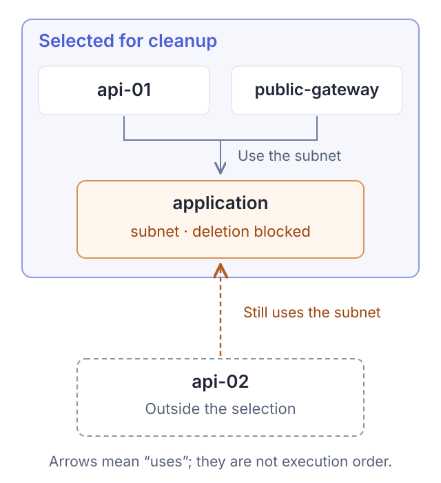
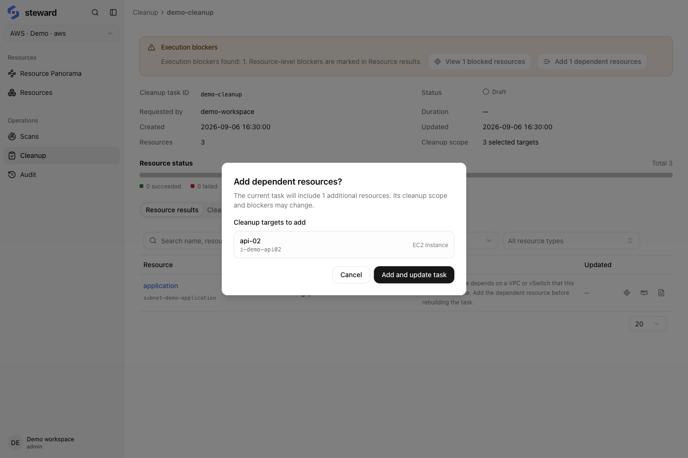

## 1. Select targets and create a task

Add targets from Resources or Resource panorama, then create a cleanup task. You can also start a task from Cleanup. Begin with a small set of resources you have confirmed are no longer needed.

Account, region, and group targets can resolve to many resources. Check the resolved list after creation, not just the target name. Creating the task does not execute deletion.

## 2. Review blockers and retained resources

-   Check resource IDs, regions, deletion actions, and scope.
-   Inspect dependencies that still use a target, and resources deleted through their owning controller.
-   Check skipped and retained resources, including residuals that may continue billing.

### Example: an unselected instance still uses the vSwitch

The sample task selects `api-01`, `public-gateway`, and the `application` vSwitch. Another instance, `api-02`, is outside the selection but still uses that vSwitch.

<figure class="docs-figure"><figcaption>The diagram shows the resources involved in this blocker. Arrows indicate use; dependencies outside the selection also affect the plan.</figcaption></figure>

If `api-02` must stay, remove the vSwitch target. If it should also be deleted, add the dependency and review the updated task. Expanding the selection is a new scope decision; do not add a resource just to clear a blocker.

Open the task's blocker details to check the resource IDs and relationship evidence. The actual interface below shows the same sample data:

<figure class="docs-figure"><figcaption>The application vSwitch is still used by api-02 outside the cleanup selection · Sample data · click to enlarge</figcaption></figure>

<aside class="docs-note">Incomplete scan coverage is a warning and may not prevent execution. Scan the relevant scope first; zero blockers does not prove every dependency has been discovered.</aside>

## 3. Confirm execution

After review, start execution and complete the confirmation dialog. Account-wide or region-wide scopes also require typing the exact target name. Submission starts deletion through the provider APIs.

Concurrency defaults to 20 and accepts 1–100. Reduce it if you encounter throttling. Execution follows dependency order and reads back results.

## 4. Verify results

Check each status in Resource results and filter Cleanup logs by resource ID to investigate failures. Pausing does not revoke requests already sent or restore deleted resources.

After fixing the cause, use the task’s available continue or resume action; completed resources are not executed again. Scan afterward and check retained resources and billing. Audits record the actor, action, and result.
