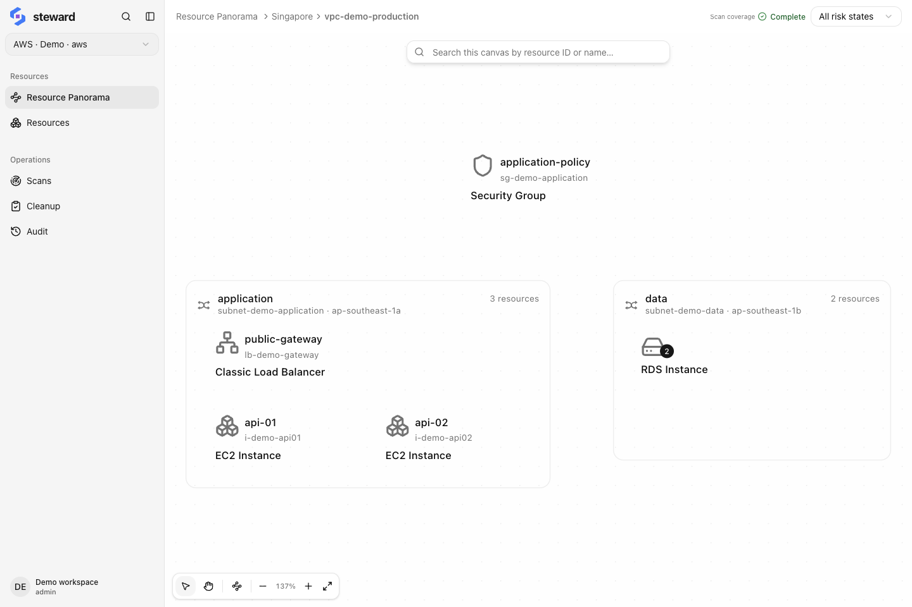

## Start here

Steward helps you inventory existing cloud resources, understand their relationships, and review the impact before executing cleanup.

- **Understand the product:** [What is Steward?](./intro.md) explains scans, resource records, and cleanup.
- **Complete a task:** [First resource inventory](./tutorials/first-inventory.md) walks through verifying scan results for a known resource.
- **Find an operation:** Use the sidebar for connection, scan, inventory, relationship, and cleanup guides.

Steward supports Alibaba Cloud, AWS, Google Cloud (GCP), and Microsoft Azure. Run it on your own computer or server, or use the invitation-only Steward Cloud hosted by LoomX.

<a href="./quick-start.md"><strong>Self-host Steward</strong>↗Install and start a local server</a><a href="https://steward.console.loomx.ai"><strong>Steward Cloud</strong> ↗Have an invitation? Open your workspace</a><a href="./azure.md"><strong>Microsoft Azure</strong>Subscriptions, service principals, and resource locks</a>

## Connect your cloud

Choose your platform for credentials, permissions, inventory coverage, and cleanup considerations.

<a href="./alicloud.md"><strong>Alibaba Cloud</strong>RAM, STS, and browser authorization</a><a href="./aws.md"><strong>AWS</strong>IAM, resource discovery, and stacks</a><a href="./gcp.md"><strong>Google Cloud</strong>Projects, service accounts, and global networks</a><a href="./azure.md"><strong>Microsoft Azure</strong>Subscriptions, service principals, and resource locks</a>

## Common operations

1.  [Add a cloud connection](./connections.md), validate its credentials, and check its regions.
2.  [Run a scan](./scans.md) and wait for the selected scope to finish.
3.  [Find a resource](./resources.md), open its details, and check its properties and last-seen time.
4.  [Inspect its relationships](./topology.md) to see what still depends on it.
5.  When deletion is needed, [create a cleanup task](./cleanup.md) and review its scope.

## Resource panorama

<figure class="docs-figure"><figcaption>vSwitches, instances, databases, and a security group in one VPC · Sample data · click to enlarge</figcaption></figure>

Inventory and relationship views reflect scan results. Scan again after cloud-side changes. Cleanup tasks list blockers and retained resources; creating a task does not immediately delete anything.
