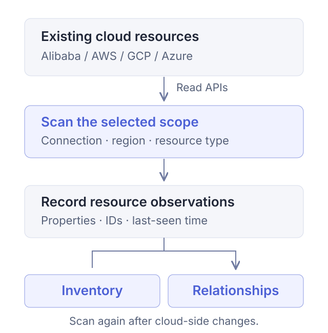

Steward is a cloud resource inventory and cleanup tool. It brings existing resources into one interface so you can see what is running, how resources relate, and what a cleanup would affect. It supports Alibaba Cloud, AWS, Google Cloud (GCP), and Microsoft Azure. You can self-host it or sign up for Steward Cloud.

Use it for three kinds of work:

- **Inventory existing resources:** Scan a selected scope and find resources by name, ID, and properties.
- **Inspect shared dependencies:** Navigate from a network overview to resources and their discovered relationships.
- **Review and execute cleanup:** Add targets to a task, inspect blockers and retained items, then confirm execution.

For your first session, read how it works below, then follow [First resource inventory](./tutorials/first-inventory.md) to inspect a resource you already have.

## How Steward works

Steward reads existing resources through a cloud connection and organizes scan results into a searchable inventory and relationship views. Start by inspecting what is running, then create cleanup tasks for resources you have confirmed are no longer needed.

<figure class="docs-figure"><figcaption>A scan records resources with observation timestamps. Inventory and relationship views show those scan results.</figcaption></figure>

Validating a connection, scanning resources, and executing cleanup are separate operations. Validation checks the cloud identity; scanning calls read APIs; confirming cleanup execution starts the corresponding cloud deletion requests.

## Connections and resource identity

A **cloud connection** stores the configuration for accessing a cloud identity. Resources, scans, and cleanup tasks are organized by connection. After switching connections, confirm the account before interpreting the results.

Names are convenient labels, but they can change or be reused. Identify a resource using its **cloud connection, region, resource type, and native cloud resource ID**. In the screenshots, `api-01` is a name and `i-demo-api01` is its native resource ID.

| Concept | Question it answers | Example |
| --- | --- | --- |
| Cloud connection | Which identity and account are you using? | An Alibaba Cloud, AWS, Google Cloud, or Azure connection |
| Region | Where is the resource? | `ap-southeast-1` |
| Resource type | What kind of resource is it? | An ECS instance, VPC, or security group |
| Native resource ID | Which specific resource is this? | `i-demo-api01` |
| Scan scope | What does this scan actually inspect? | One region or a VPC within it |

Global resources are included separately in the scan scope. Scanning a region does not also scan global resources or other regions. See [connection settings](./connections.md) and [scan scopes](./scans.md#scope) for these choices.

## Scan results and current cloud state

A **scan** reads cloud APIs within a selected scope and records discovered resources and their properties. A resource's last-seen time records when a scan observed it.

For example, suppose a scan finds an instance and you later change it in the cloud console. Steward may still show the earlier observation until you scan the relevant scope again. Refreshing the browser reloads existing records; it does not replace a scan.

Interpret scan results using both:

- **Scope:** Which regions, global resources, and resource types did you select?
- **Outcome:** Did those scan targets finish, and were there permission errors or failed targets?

A successful scan of a small scope does not prove that the entire account has been inventoried. Zero results can also mean that the scope is wrong, permissions are missing, or a resource type was not covered. Inspect the task before concluding that no cloud resources exist.

## Resource panorama and relationship lines

**Resource panorama** helps you locate resources by account, region, and network structure. **Relationship lines** show associations recognized by the current rules, such as a load balancer routing to instances or an instance using a security group.

Sharing a VPC or vSwitch describes network placement. Assess specific dependencies using resource properties, relationship lines, and cleanup checks together. The absence of a line does not establish the absence of a dependency.

<figure class="docs-figure"><figcaption>Sample application instances and databases occupy different vSwitches. Network grouping locates resources; relationship lines explain further associations.</figcaption></figure>

[Resource relationships](./topology.md) shows how to navigate through network scopes and then focus on one resource's connections.

## Cleanup selection, tasks, and execution

Cleanup narrows the scope through distinct stages:

| Stage | What you review | Does cloud deletion start? |
| --- | --- | --- |
| Cleanup selection | Which targets need further review | No |
| Create a task | Resolved resources, blockers, warnings, and retained items | No |
| Confirm execution | Whether the reviewed scope and impact match your intent | Yes |
| Verify results | Completed, failed, and retained resources | Deletion requests may still be in progress |

A task checks dependencies and supported deletion actions. Resolve blockers and read warnings, especially incomplete scan coverage. Once execution starts, pausing cannot revoke requests already sent or restore deleted resources.

Complete [your first resource inventory](./tutorials/first-inventory.md), then read the dependency example and execution steps in [Resource cleanup](./cleanup.md).
