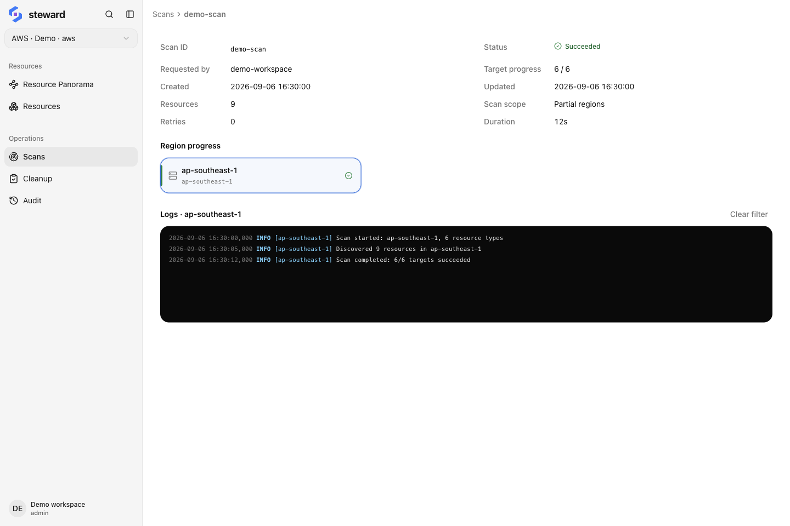
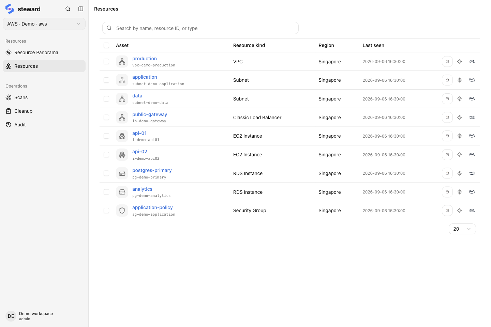
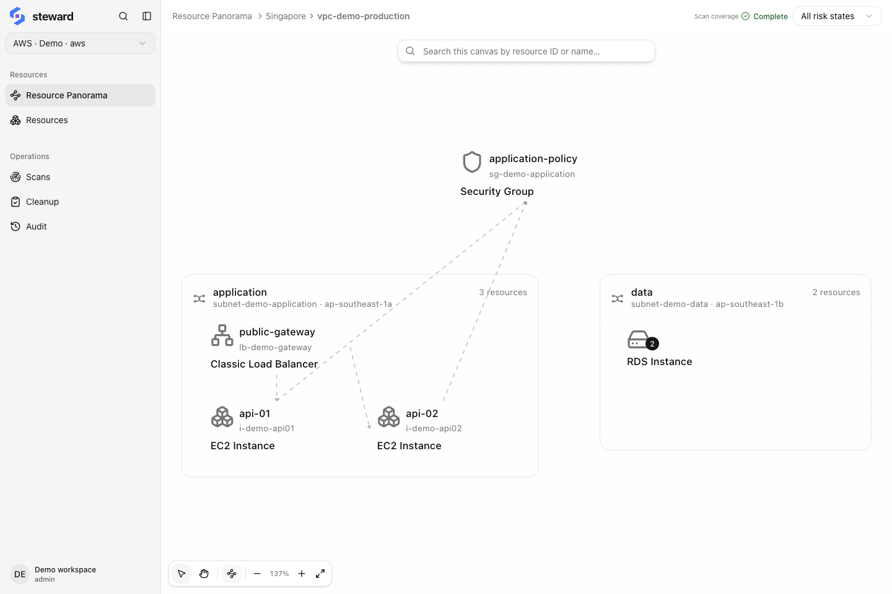

## What you will accomplish

This tutorial walks through a small inventory: connect a cloud account, scan one region, find a known resource, and inspect its network placement and related resources. By the end, you should be able to identify its account, explain when the data was observed, and name dependencies that still need verification.

The steps connect, scan, and inspect resources. Screenshots use Alibaba Cloud sample data; substitute your actual region and resource ID when working in your own account. Steward does not automatically create the example resources such as `api-01`.

## Before you start

You will need:

- Steward running through the [quick start](../quick-start.md), or an available Steward Cloud workspace.
- An Alibaba Cloud, AWS, Google Cloud, or Azure account you can access, with credentials that have the required read permissions.
- A regional resource you know exists and that Steward supports discovering, such as a cloud instance. Record its **region, resource type, and native resource ID**.

Choose a small scope you know well. You do not need to create cloud resources or grant deletion permissions for this tutorial. Without a cloud account, explore the sample demo on the [LoomX homepage](https://loomx.ai/) to learn the inventory and relationship views; a real scan requires your own cloud connection.

## 1. Add and select a cloud connection

Open the user menu → Settings → Cloud connections, add a connection, and validate its credentials. Give it a recognizable name and check that the discovered regions match your account. See [Cloud connections](../connections.md#credentials) for credential types.

Return to the main interface and select this connection.

**Check the result:** The active connection is the account you intend to inspect, validation has passed, and your known resource's region is available. If validation fails, check the credentials, expiration, and error details before continuing.

## 2. Scan the resource's region

Open Scans → Start scan, choose selected regions, and select the region containing your known resource. For this first check, leave resource types empty to use all indexed types within the scope. Submit the scan and open its details.

The example uses `ap-southeast-1`; use your resource's actual region. Global resources are outside an individual region and require selecting Global separately.

<figure class="docs-figure"><figcaption>Check the target scope first, then completion and failure logs. Resource counts in this screenshot come from sample data.</figcaption></figure>

**Check the result:** Your selected targets have finished, with no unexplained permission errors or failed targets. If some targets fail, address the logged cause and use the task's retry action. See [Progress and failed targets](../scans.md#progress).

## 3. Find and identify the resource

Open Resources, enter the known native resource ID in ordinary search, and open the matching resource. Using the ID helps distinguish resources that share a name.

<figure class="docs-figure"><figcaption>Use the resource ID and region to confirm identity, and the last-seen time to assess freshness. The name is a useful label.</figcaption></figure>

Compare the record with your cloud console or the information you recorded earlier:

1. Confirm the active connection, region, and resource type.
2. Match the native resource ID and check the name and key properties.
3. Check that the last-seen time corresponds to your scan.

**Check the result:** You can match one Steward record to the same resource in the cloud. If it is missing, check the connection, region, and failed scan targets before concluding that the resource no longer exists.

## 4. Inspect network placement and relationships

For a resource in a VPC, use View in Resource panorama from its details. Check the region, VPC, and vSwitch or subnet. Enable Show relationship lines in the canvas toolbar, or open Relationships in the resource details.

<figure class="docs-figure"><figcaption>The sample instances share a load balancer and security group. Inspect shared relationships before deciding the scope of any later cleanup review.</figcaption></figure>

For resources outside a VPC network, inspect their properties and available relationships in the details view. Your account does not need to reproduce the network hierarchy in the screenshot.

**Check the result:** You can explain the resource's placement and identify discovered relationships. If no lines appear, check that related resources were scanned and that the current rules cover those relationships. Missing lines do not prove that no dependencies exist.

## 5. Record your inventory result

Create a short record for your own resource:

| Item | What to record |
| --- | --- |
| Resource identity | Connection, region, resource type, and native resource ID |
| Observation time | Last-seen time and the corresponding scan task |
| Scan scope | Regions and types covered, plus any gaps |
| Relationships | Confirmed shared resources and dependencies still to verify |

You have now completed an inventory you can verify. After later cloud-side changes, scan the relevant scope again before comparing resource records.

## When results differ from expectations

| Symptom | What to check first |
| --- | --- |
| The connection works, but one resource type fails to scan | Read permissions for that resource API; connection validation does not check every resource permission |
| A known resource is missing from search | The active connection, region, resource type, and target scan results |
| Properties still show an earlier value | Last-seen time; scan again before refreshing the page |
| An expected relationship line is missing | Whether related resources were scanned and whether current rules cover the relationship |

Continue with [Resource inventory](../resources.md) to combine query conditions. Before cleanup, read the [blocker example](../cleanup.md#review). You do not need to execute deletion to complete this tutorial.
