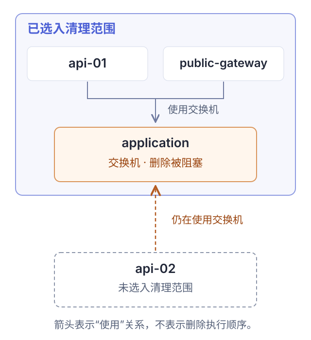
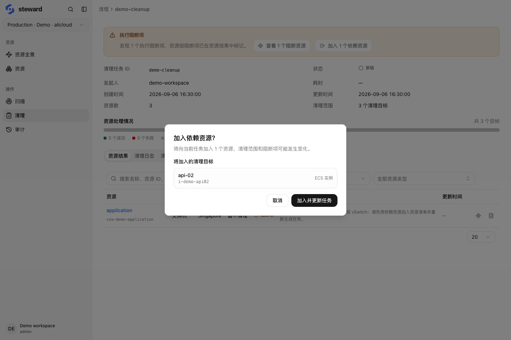

## 1. 选择目标并创建任务

从资源列表或资源全景加入清理清单，再创建清理任务。也可在「清理」页面新建任务。初次使用先选择少量已确认不再需要的资源。

账号、项目、地域或分组目标会解析出多项资源。创建后检查实际解析的清单，不要只看目标名称。创建任务不会执行删除。

## 2. 审查阻塞与保留项

-   核对资源 ID、地域、删除动作与影响范围。
-   查看仍在使用目标的依赖资源，以及需要随所属控制器删除的资源。
-   检查跳过项、保留项和可能继续计费的残留资源。

### 例子：范围外的实例仍在使用交换机

示例任务选择了 `api-01`、`public-gateway` 和 `application` 交换机。另一台实例 `api-02` 未被选中，但仍使用该交换机。

<figure class="docs-figure"><figcaption>示意图只展开这项阻塞涉及的资源。箭头表示使用关系，清理范围之外的依赖也会影响计划。</figcaption></figure>

如果 `api-02` 必须保留，就移除交换机目标；如果它也确定需要删除，可加入依赖资源并重新审查更新后的任务。扩大选择是一项新的范围决定，不能仅为了让阻塞提示消失而加入资源。

在任务中打开阻塞详情，核对具体资源 ID 和关联依据。下面的真实界面展示了同一组示例数据：

<figure class="docs-figure"><figcaption>交换机 application 仍被清单之外的 api-02 使用 · 示例数据，点击放大</figcaption></figure>

<aside class="docs-note">扫描覆盖不完整属于警告，未必阻止执行。先补扫相关范围；不要把「没有阻塞项」当作依赖已完整发现。</aside>

## 3. 确认执行

检查完成后点击执行，按确认框要求勾选确认项。整账号、项目或地域范围还需要准确输入目标名称。提交后会调用云厂商 API 删除资源。

并发数默认为 20，可设为 1–100。遇到限流时降低并发。执行按依赖顺序推进，并回读结果。

## 4. 核对结果

在「资源结果」查看每项状态，在「清理日志」按资源 ID 排查失败。暂停不会撤销已发出的删除请求，也不会恢复已删除资源。

修正失败原因后，使用任务提供的继续或恢复操作；已完成资源不会再次执行。清理后重新扫描，并检查保留项和账单。审计页记录操作者、动作和结果。

使用 Google Cloud 时，请先查看[清理范围与删除保护](./gcp.md#删除保护)，包括 VM 磁盘自动删除、非空存储桶和只读 GKE 集群。
