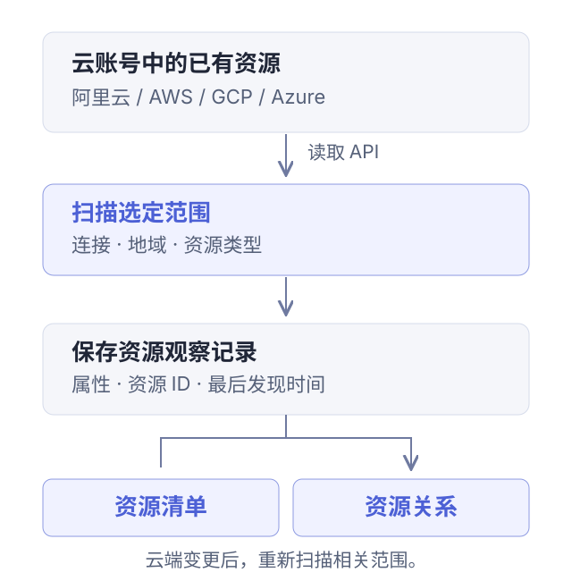

Steward 是云资源盘点与清理工具。它把云账号中已有的资源整理到统一界面，帮助你确认“有什么、彼此如何关联、清理会影响什么”。目前支持阿里云、AWS、Google Cloud（GCP）和 Microsoft Azure，可自行部署，也可注册使用 Steward Cloud。

你可以用它完成三类工作：

- **盘点存量资源**：扫描指定范围，按名称、ID 和属性查找资源。
- **检查共享依赖**：从网络全景进入资源，查看已发现的上下游关联。
- **审查并执行清理**：把目标加入任务，检查阻塞和保留项，再确认执行。

如果第一次使用，先读完下面的工作原理，再跟随[第一次资源盘点](./tutorials/first-inventory.md)检查自己的一项已有资源。

## Steward 如何工作

Steward 通过云连接读取已有资源，把扫描结果整理成可查询的资源清单和关系图。你可以先完成盘点，再针对确认不再需要的资源创建清理任务。

<figure class="docs-figure"><figcaption>扫描生成一份带观察时间的资源记录。资源清单与关系图展示的是扫描结果。</figcaption></figure>

连接验证、资源扫描和清理执行是不同的操作。连接验证确认云身份；扫描调用读取接口；确认执行清理后，才会调用相应的云端删除接口。

## 云连接与资源身份

一个**云连接**保存访问某个云身份的配置。资源、扫描和清理任务按连接组织。切换连接后，先确认当前账号，再解释页面上的结果。

资源名称方便阅读，但名称可以重复或改变。核对资源时，结合**云连接、地域、资源类型和云资源 ID**。例如，截图中的 `api-01` 是名称，`i-demo-api01` 是云资源 ID。

| 概念 | 回答的问题 | 例子 |
| --- | --- | --- |
| 云连接 | 用哪个身份访问哪个账号？ | 阿里云、AWS、Google Cloud 或 Azure 连接 |
| 地域 | 资源位于哪里？ | `ap-southeast-1` |
| 资源类型 | 这是什么资源？ | ECS 实例、VPC、安全组 |
| 云资源 ID | 具体是哪一项资源？ | `i-demo-api01` |
| 扫描范围 | 这次实际检查了哪些资源？ | 一个地域，或其中一个 VPC |

全局资源单独纳入扫描范围。扫描一个地域，不等于同时扫描了全局资源或其他地域。[连接设置](./connections.md)与[扫描范围](./scans.md#scope)分别说明这些选择。

## 扫描结果与当前云端状态

**扫描**在指定范围内读取云 API，保存发现的资源及其属性。资源的“最后发现时间”表示扫描何时观察到了它。

例如，你先扫描到一台实例，随后在云控制台修改它。Steward 中的记录可能仍是修改前的结果，需要重新扫描相关范围。刷新浏览器页面会重新读取已有记录，不能代替扫描。

解释扫描结果时要同时看两件事：

- **范围**：选中了哪些地域、全局范围和资源类型？
- **结果**：这些扫描目标是否完成，有没有权限错误或失败项？

成功扫描一个较小范围，不能证明整个账号已经盘点完整。零条结果也可能来自范围不符、权限不足或资源类型未被覆盖。先检查任务详情，再判断云端是否确实没有资源。

## 资源全景与关系连线

**资源全景**按账号、地域和网络结构帮助你定位资源。**关系连线**补充展示当前规则能够识别的关联，例如负载均衡指向实例、实例使用安全组。

同处一个 VPC 或交换机，说明资源共享某种网络位置；具体依赖还需要结合资源属性、关系连线和清理检查判断。没有连线，也不能据此认定资源没有依赖。

<figure class="docs-figure"><figcaption>示例中的应用实例与数据库位于不同交换机。网络分组帮助定位资源，关系连线进一步解释关联。</figcaption></figure>

[查看资源关系](./topology.md)展示了如何从网络位置进入，再以单个资源为中心查看关联。

## 清理清单、任务与执行

清理操作逐步收敛范围，每一步保存的信息不同：

| 阶段 | 你需要确认什么 | 是否开始云端删除 |
| --- | --- | --- |
| 清理清单 | 哪些目标值得进一步审查 | 否 |
| 创建任务 | 目标实际解析出了哪些资源，有什么阻塞、警告和保留项 | 否 |
| 确认执行 | 审查后的范围和影响是否符合预期 | 是 |
| 核对结果 | 哪些资源已完成、失败或保留 | 删除请求可能仍在进行 |

清理任务会检查依赖与支持的删除动作。阻塞项需要处理；警告同样需要阅读，尤其是扫描覆盖不完整时。执行开始后，暂停不能撤回已经发出的请求，也不能恢复已删除资源。

先完成[第一次资源盘点](./tutorials/first-inventory.md)，再阅读[清理资源](./cleanup.md)中的依赖示例和执行步骤。
