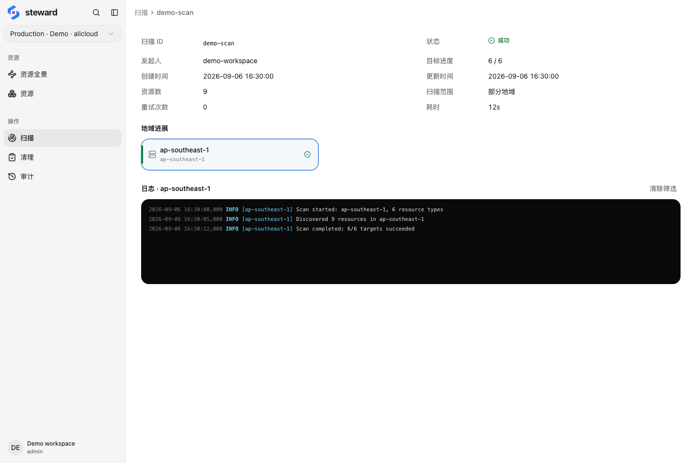

## 选择扫描范围

选中云连接，进入「扫描」→「开始扫描」。首次使用建议选择一个地域，确认权限和结果后再扩大范围。

-   **全部启用地域 + 全局**：覆盖连接当前的活跃地域和全局资源。
-   **指定地域**：只扫描勾选的地域；需要全局资源时单独勾选「全局」。
-   **指定 VPC / 交换机**：按网络范围扫描。先选择地域，再按名称或 ID 查找目标。

地域扫描可指定资源类型，留空则使用全部已索引类型。网络范围扫描由目标网络确定类型范围。

## 查看进度和失败项

<figure class="docs-figure"><figcaption>扫描详情按目标展示进度和发现的资源数量 · 示例数据，点击放大</figcaption></figure>

打开任务，查看地域进度、资源数和日志。部分目标失败时，先根据日志修正权限、凭证或访问问题，再使用任务中可用的「重试」。

运行中的任务可按当前状态暂停、恢复或取消。取消不会撤回已发现的数据。

## 何时重新扫描

云端新增、迁移或删除资源后，以及准备大范围清理前，重新扫描相关范围。最后发现时间较早的资源应先核实。

<aside class="docs-note">扫描未覆盖的地域或资源类型，不能据此判断为空。覆盖不完整时，关系图和清理任务可能缺少依赖。</aside>
