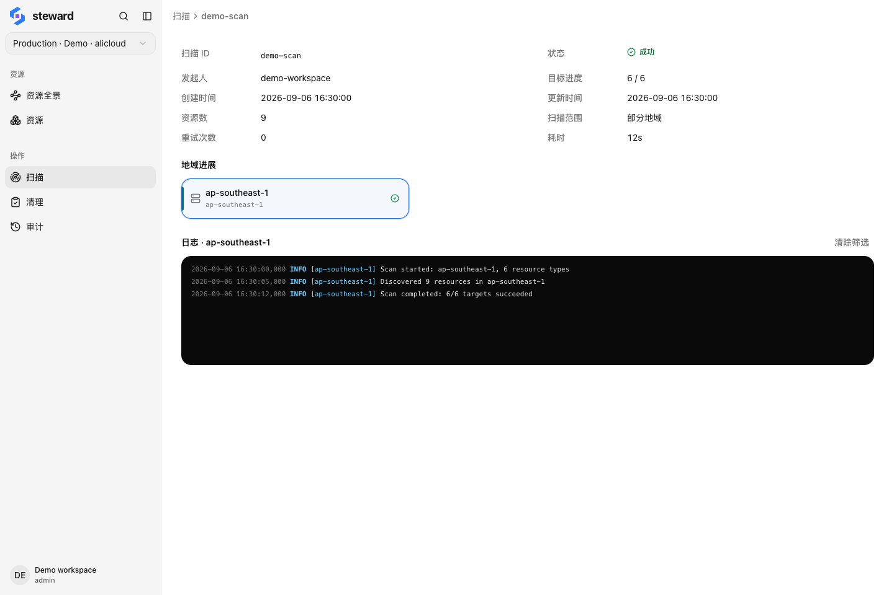

扫描会针对一个云连接读取云厂商 API，更新**资源**、**资源全景**以及资源之间的关系。依赖资源清单之前先扫描一次，清理之前再扫描一次。

## 选择扫描范围

1. 确认左上角的**当前云连接**。一次扫描只覆盖这个连接。
2. 进入**扫描** → **开始扫描**。
3. 选择**扫描范围**（见下表）；按地域扫描时，可以限定**资源类型**。
4. 点击**创建扫描**，页面进入扫描详情。

首次扫描建议选一个确定有资源的地域，确认权限和结果后再扩大范围。

| 扫描范围 | 覆盖内容 | 适用场景 |
| --- | --- | --- |
| **全部启用地域 + 全局** | 连接中所有标记为**启用**的地域，以及全局资源。地域列表在**设置** → **云连接** → **管理地域**中维护。 | 完整盘点；大范围清理前；删除密钥或身份前（清理[要求完整扫描](./cleanup.md#review)）。 |
| **选择部分地域** | 只扫描勾选的地域。全局资源（如 RAM 身份）只有同时勾选**全局**时才会扫描。 | 首次扫描，或复查特定地域。 |
| **指定 VPC / vSwitch** | 所选网络内的资源。先选择**查询地域**，再按名称或 ID 搜索 VPC 和交换机（AWS 中为子网）。选中 VPC 即覆盖其下的交换机。不包含全局资源。 | 快速复查某个网络。 |

按地域扫描时，**资源类型**留空即扫描**全部已索引资源类型**。按网络扫描时，资源类型由所选网络决定。

## 查看进度和失败项

<figure class="docs-figure"><figcaption>扫描详情按目标展示进度和发现的资源数量 · 示例数据，点击放大</figcaption></figure>

扫描详情页展示**目标进度**、**地域进展**、资源数和**日志**。每个扫描项读取一个地域或网络目标中的一种资源类型。

### 失败项意味着什么

扫描项失败，意味着该地域、该资源类型的清单存在缺口：

- Steward 只根据成功完成的扫描项更新记录。扫描项失败时，已有记录保持不变，最后发现时间仍是之前的值。
- 只有在一次成功的读取中确认资源已不存在，Steward 才会把它从清单中移除。在此之前，云端已删除的资源仍会显示；上次成功读取之后新建的资源则不会出现。
- 如果 Steward 列出了某项资源，但读取其详情失败，会保留这项资源（不含详情属性），并在日志中记录警告。

因此，带失败项结束的扫描并不完整：搜索结果、关系连线和清理依赖检查都可能缺少这部分资源。

处理方法：查看失败项的日志，修正其中报告的权限、凭证或网络访问问题，再点击**重试**。重试会在同一个扫描任务中重新执行失败和未完成的部分。

扫描运行中，可按当前状态**暂停**、**继续**或**取消扫描**。取消会停止扫描，但保留已完成的结果和日志，不会撤回已发现的数据。

## 查看资源变化

扫描详情页的**资源变化**列出这次扫描与之前相比的变化：

| 变化 | 含义 |
| --- | --- |
| **新增** | 第一次发现的资源，或之前消失、这次又出现的资源。 |
| **消失** | 成功读取后确认已不存在的资源。扫描项失败时不会产生消失记录。 |
| **修改** | 名称、状态、地域、标签或配置属性有变化。**变化内容**一栏列出每个属性的前后值。 |

- 按变化类型筛选，或按名称、资源 ID 搜索。点击资源名称打开资源详情。
- 只比较界面上可见的属性。云厂商原始数据中的计数器、时间戳等每次都会变的字段不算修改。
- 云连接的第一次扫描中，所有资源都记为**新增**。
- **扫描任务**列表和[定时扫描](./schedules.md#runs)的运行记录中，**资源变化**一列显示 `+新增 −消失 ~修改`，点击直达明细。

## 何时重新扫描

- 云端新增、迁移或删除资源之后。
- 大范围清理之前，扫描准备清理的完整范围。
- 资源的最后发现时间早于你已知的变更时。先核实，再据此操作。

在**资源全景**中右键点击某个地域并选择**重新扫描**，可以只重新扫描该地域。Steward 会创建新的扫描任务并打开其详情。

不想依赖手动扫描时，开启[定时扫描](./schedules.md)。资源页面右上角显示当前连接最近一次完整扫描的时间。

<aside class="docs-note">扫描未覆盖的地域或资源类型，不能据此判断为空。覆盖不完整时，关系图和清理任务都可能缺少依赖。</aside>

## 云厂商说明

- **Google Cloud**：资源清单来自 Cloud Asset Inventory，可能晚于云端的实际变化。首次建议选择**全部启用地域 + 全局**。参阅 [Google Cloud](./gcp.md)。
- **Azure**：通过 ARM 和各产品 API 盘点，并显式发现支持的子资源。首次建议选择**全部启用地域 + 全局**。网络范围名为**指定网络**，可选择虚拟网络 / 逻辑网络和子网。参阅 [Microsoft Azure](./azure.md)。
