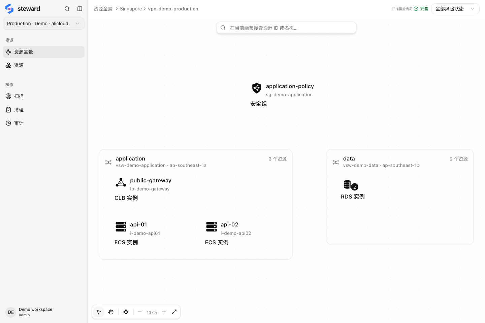

## 逐层进入网络

进入「资源全景」，从账号选择地域，再进入 VPC。全局资源和地域公共资源使用单独入口。面包屑可返回上一级。

<figure class="docs-figure"><figcaption>production VPC：应用与数据库位于不同交换机 · 示例数据，点击放大</figcaption></figure>

VPC 视图按交换机展示资源。聚合节点可展开查看成员；搜索可定位名称或 ID。选中资源后查看属性，或加入清理清单。

## 显示关系连线

点击画布工具栏中的「显示关系连线」。本例中，public-gateway 指向两台 ECS 实例，两台实例共用 application-policy 安全组。

<figure class="docs-figure"><figcaption>两台 ECS 共用负载均衡和安全组 · 示例数据，点击放大</figcaption></figure>

只关心一项资源时，从资源详情切换到「关系」，以该资源为中心查看关联。

## 如何使用这些关系

删除共享网络或安全组前，检查是否还有其他实例使用它。依赖图用于发现线索，最终以清理任务中的检查结果和云端状态为准。

关系来自已扫描资源和当前支持的关系规则。没有连线，不代表没有依赖；覆盖不完整时先补充扫描。
