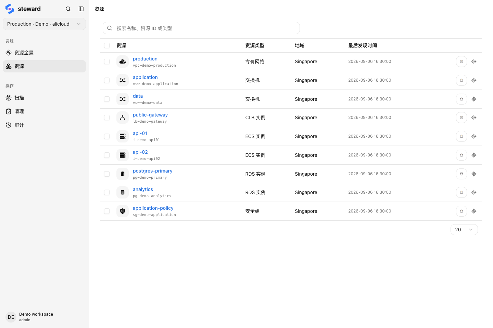

## 完成后你会得到什么

本教程带你完成一次小范围盘点：连接云账号、扫描一个地域、找到一项已知资源，再检查它所在的网络和关联资源。完成后，你应能说明这项资源属于哪个账号、数据何时被观察到，以及哪些依赖还需要进一步核实。

教程只进行连接、扫描和查看。截图使用阿里云示例数据；在自己的账号中操作时，请替换为实际地域和资源 ID。Steward 不会自动创建截图里的 `api-01` 等示例资源。

## 开始之前

准备以下条件：

- 已按[快速开始](../quick-start.md)启动 Steward，或已有可用的 Steward Cloud 工作区。
- 一个可访问的阿里云或 AWS 账号、Google Cloud 项目或 Azure 订阅，以及具有所需读取权限的云凭证。
- 一项你已知存在、且 Steward 支持盘点的地域资源，例如云主机。记下它的**地域、类型和云资源 ID**。

优先选择熟悉的小范围。无需为了本教程创建云资源，也无需授予删除权限。如果暂时没有云账号，可以先在 [LoomX 首页](https://loomx.ai/)操作示例演示，熟悉资源列表和关系视图；真实扫描需要自己的云连接。

## 1. 添加并选中云连接

打开用户菜单 → 设置 → 云连接，添加连接并完成凭证验证。选择容易区分的名称，确认发现的地域与账号一致。具体凭证类型见[连接云账号](../connections.md#credentials)。

返回主界面，选中这个连接。

**检查结果**：当前连接是你准备盘点的账号，连接验证通过，已知资源所在的地域可供选择。验证失败时先检查凭证、有效期和错误详情；不要继续使用另一个账号的结果作比较。

## 2. 扫描已知资源所在的地域

进入「扫描」→「开始扫描」，选择「指定地域」，勾选已知资源所在的地域。首次验证可将资源类型留空，使用该范围内全部已索引类型。提交扫描后打开任务详情。

本例使用 `ap-southeast-1`，但你应以资源实际所在地域为准。全局资源不包含在单个地域中，需要另选「全局」。

<figure class="docs-figure"><figcaption>先核对目标范围，再看完成状态和失败日志。截图中的资源数量仅来自示例数据。</figcaption></figure>

**检查结果**：你选择的目标已完成，且没有尚未解释的权限错误或失败项。若部分目标失败，按日志修正原因后使用任务提供的重试操作；排查步骤见[查看进度和失败项](../scans.md#progress)。

## 3. 找到并核对那项资源

进入「资源」，用普通搜索输入已知的云资源 ID，打开对应详情。使用 ID 可避免把同名资源认成同一项。

<figure class="docs-figure"><figcaption>以资源 ID 和地域确认身份，以最后发现时间判断数据的新鲜程度；名称用于辅助识别。</figcaption></figure>

对照云控制台或你事先记录的信息，检查：

1. 当前连接、地域和资源类型是否正确。
2. 云资源 ID 是否一致，名称和关键属性是否符合预期。
3. 最后发现时间是否与刚才的扫描相符。

**检查结果**：你能把 Steward 中的一条记录对应到云端的同一项资源。找不到时先检查连接、地域和扫描失败项，不要仅凭空列表判断资源已不存在。

## 4. 查看网络位置与关联

对于位于 VPC 中的资源，从详情选择「在资源全景中查看」，核对地域、VPC 和交换机或子网。打开画布工具栏中的「显示关系连线」，或在详情中切换到「关系」。

<figure class="docs-figure"><figcaption>本例中，两台实例共用负载均衡和安全组。检查共享关系后，才能判断是否需要扩大后续审查范围。</figcaption></figure>

如果目标不属于 VPC 网络，使用资源详情查看属性与已有关系即可。不要为了复现截图而寻找并不存在的网络层级。

**检查结果**：你能解释资源的位置，并指出已发现的关联。若没有连线，先核实相关资源是否已扫描、当前类型是否支持这些关系；不能直接得出“没有依赖”的结论。

## 5. 记录盘点结论

用自己的资源填写一条记录，方便下一次核对：

| 项目 | 记录内容 |
| --- | --- |
| 资源身份 | 连接、地域、类型、云资源 ID |
| 数据时间 | 最后发现时间，以及对应扫描任务 |
| 扫描范围 | 本次覆盖的地域和类型，仍未覆盖的范围 |
| 关联情况 | 已确认的共享资源，以及待核实的依赖 |

做到这里，你已完成一次可以核验的资源盘点。以后云端发生变更，先重新扫描相关范围，再比较资源记录。

## 结果与预期不一致时

| 现象 | 先检查什么 |
| --- | --- |
| 连接正常，但某类资源扫描失败 | 该资源 API 的读取权限；连接验证不能代替资源权限检查 |
| 搜不到已知资源 | 当前连接、地域、资源类型与目标扫描结果 |
| 属性仍是修改前的值 | 最后发现时间；重新扫描后再刷新页面 |
| 关系图缺少预期连线 | 关联资源是否在扫描范围内，以及当前关系规则的覆盖 |

继续阅读[查询资源](../resources.md)学习组合筛选；准备清理时，先阅读[清理资源](../cleanup.md#review)中的阻塞示例。完成本教程不需要执行删除。
